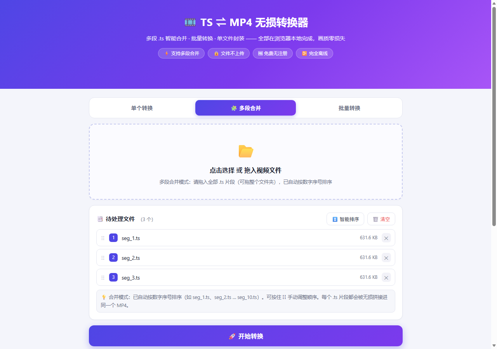
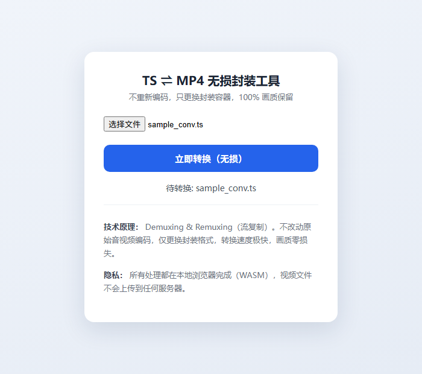

# TS ⇌ MP4 无损转换器

纯浏览器端的 TS → MP4 无损封装工具。只更换封装容器，不重新编码，画质零损失，文件不上传任何服务器。



选中文件后：



## 功能

- TS / M2TS / MTS / MP4 → MP4，`-c copy` 流复制，无损快速
- 输出带 `+faststart`，可边加载边播放
- 完全离线：基于 FFmpeg.wasm，全部在本地浏览器运行
- 打开即用，无需安装，无账号

## 使用

1. 打开 `index.html`（建议用本地 HTTP 服务访问，避免跨域限制）
2. 选择 `.ts` 视频文件
3. 点击「立即转换（无损）」，完成后保存 MP4

## 原理

```bash
ffmpeg -i input.ts -c copy -movflags +faststart output.mp4
```

`-c copy` 表示流复制：不重新编码，直接把音视频流重新封装进 MP4 容器，速度最快、画质无损。

## 本地运行

```bash
python -m http.server 8000
# 浏览器打开 http://localhost:8000
```

---

如果对你有帮助，欢迎 Star ⭐
