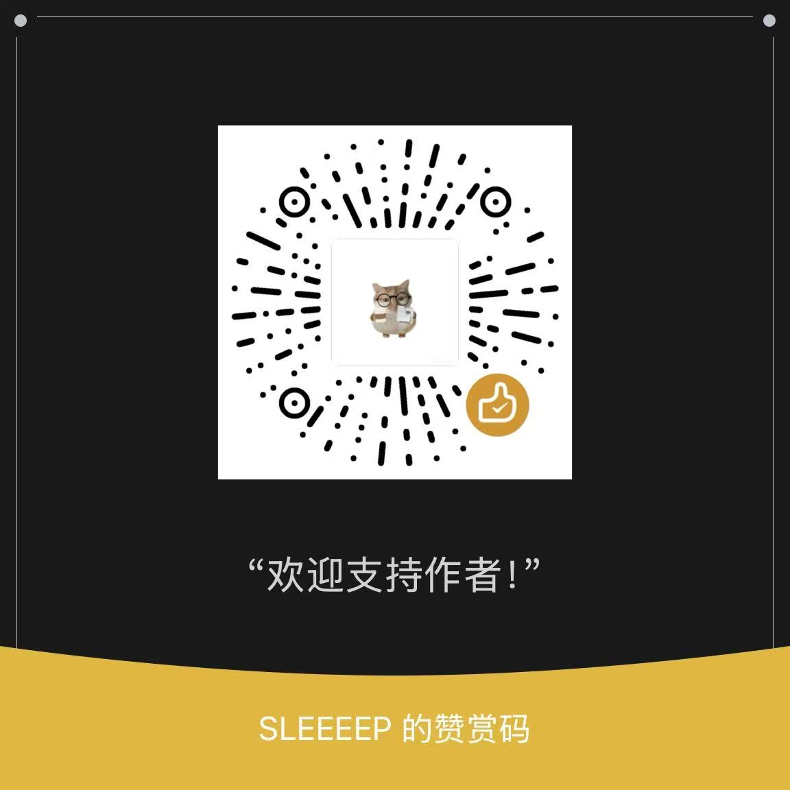

# 🎞️ TS ⇌ MP4 转换器 · 多段合并无损转码

> 纯浏览器端的 **TS ⇌ MP4** 工具：**多段 .ts 智能合并**、批量转换、单文件双向封装。基于 FFmpeg.wasm，全部在本地浏览器完成，**画质零损失、文件不上传任何服务器、免费无注册**。

🔗 在线使用：**[https://qgeng1465.github.io/ts-to-mp4-converter/](https://qgeng1465.github.io/ts-to-mp4-converter/)**


## ✨ 为什么它是同类最强

| 功能 | 本工具 | 大多数同类 |
|---|---|---|
| 🧩 **多段 .ts 合并成一个 MP4** | ✅ 自动数字排序 + 手动拖拽调整 | ❌ 只能单文件 |
| ⚡ **无损流复制合并** | ✅ 不重编码，画质 100% 保留 | 常需重编码 |
| 🔄 **双向转换**（TS→MP4 / MP4→TS） | ✅ | 通常只做单向 |
| 📦 **批量转换**（多文件各自输出） | ✅ | 少数 |
| 🧠 **智能策略**（编码不一致自动重编码保底） | ✅ | 少数 |
| 🔒 **文件不上传 / 完全离线** | ✅ FFmpeg.wasm | 多数要上传服务器 |
| 📴 打开即用、无注册、无广告 | ✅ | 常带水印/注册 |

## 🚀 功能特性

- **🧩 多段合并**：把直播录制 / M3U8 下载拆出的几十上百个 `.ts` 片段，按文件名中的数字序号自动排序，无损拼接回一个完整的 MP4。支持**拖入整个文件夹**。
- **↕️ 手动排序**：自动排序不满意？按住 `⋮⋮` 拖拽即可调整合并顺序。
- **⚡ 无损封装**：H.264/AAC 编码的 TS 片段直接流复制（`-c copy`），只换容器不重编码，速度极快、画质零损失。
- **🧠 智能回退**：片段编码或分辨率不一致时，自动改走 H.264/AAC 重编码，保证一定出结果。
- **📦 批量转换**：多个视频各自转成目标格式，逐个处理。
- **🔄 双向转换**：TS / M2TS / MTS → MP4；MP4 → TS；其余视频格式 → MP4。
- **⏱️ 进度 + 预计剩余时间**。
- **🔒 隐私安全**：所有处理都在你的浏览器本地完成（WASM），视频文件绝不会离开本机。

## 📖 使用说明

1. **多段合并**（最常见）：把下载到的所有 `.ts` 片段（可以整个文件夹）拖进页面 → 自动排序 → 点「开始转换」→ 得到合并后的单个 MP4。
2. **单个转换**：切到「单个转换」，拖入一个 `.ts` / `.mp4` 文件，一键无损封装。
3. **批量转换**：切到「批量转换」，拖入多个文件，逐个输出。

## 🔧 技术原理

```bash
# 无损单文件：流复制，只换封装容器
ffmpeg -i input.ts -c copy -movflags +faststart output.mp4

# 无损多段合并：concat 拼接，同样不重编码
# (concat.txt 中按顺序列出所有 .ts 片段)
ffmpeg -f concat -safe 0 -i concat.txt -c copy output.mp4
```

- **为什么不重新编码？** TS 片段通常已是 H.264/AAC，与 MP4 容器完全兼容，流复制即可 100% 保留画质，且耗时远小于重编码。
- **合并原理**：等价于把 M3U8 分片还原成完整视频，只是整个过程在浏览器本地完成。
- 所有依赖（FFmpeg.wasm）均已内置，**运行时不访问任何 CDN**，离线可用。

## ⚠️ 提示

- 浏览器 WASM 有内存上限（通常 1–2GB）。若所有片段总大小超过 **800MB**，建议分批合并或分卷处理。
- 不同分辨率/编码的片段无法无损合并，工具会自动降级为重编码，属正常现象。

## 🛠️ 本地运行

```bash
python -m http.server 8000
# 浏览器打开 http://localhost:8000
```

> 也可直接双击 `index.html` 用浏览器打开（单线程 WASM 核心，无需跨源隔离，`file://` 即用）。

---

如果对你有帮助，欢迎 **Star ⭐** 支持～

## ☕ 打赏



## 📚 更多工具 More Tools

> 我做的所有免费工具与智能体都在这：[qgeng1465](https://github.com/qgeng1465) · 全部开源、本地优先、即装即用。

| 类别 | 项目 |
|---|---|
| ✈️ 可视化 | [飞行足迹 3D](https://github.com/qgeng1465/flight-trajectory-visualizer) · [TS→MP4](https://github.com/qgeng1465/ts-to-mp4-converter) · [MP4转换](https://github.com/qgeng1465/mp4-converter) · [音频工具箱](https://github.com/qgeng1465/audio-toolbox) |
| 🎬 下载 | [抖音](https://github.com/qgeng1465/douyin-watermark-free-downloader) · [B站](https://github.com/qgeng1465/bilibili-video-downloader) · [YouTube](https://github.com/qgeng1465/youtube-downloader) · [小红书](https://github.com/qgeng1465/xiaohongshu-downloader) · [公众号](https://github.com/qgeng1465/wechat-article-exporter) · [直播录制](https://github.com/qgeng1465/LiveRecorder) |
| 🧬 AI 智能体 | [AI4Bio](https://github.com/qgeng1465/ai4bio-agents) · [AI4Chem](https://github.com/qgeng1465/ai4chem-agents) · [AI4科研](https://github.com/qgeng1465/ai4research-agents) · [日常生活](https://github.com/qgeng1465/daily-agents) |

## 📄 License

[MIT](./LICENSE) © 2026 qgeng1465
